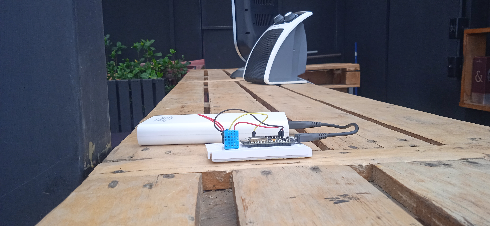

# Celo_test
Este proyecto simula un proyecto de reforestación, donde se da una estimulo a los participantes mediante el envío de celo, la la decisión de enviar el estimulo depende de sensores inteligentes que miden la humedad en el terreno y dependiendo de una meta que se despliega en el contrato inteligente, si la meta se supera en este caso medición de humedad se envía a la billetera destino 0,1 celo.
La DAPP esta alojada en AWS el front y back le 100% de la aplicación se construyo en python con el <https://github.com/blaize-tech/celo-sdk-py>, para el hardware se utilizo un micro controlador esp8266 conectado directamente a la web, este es de bajo consumo y es fácilmente alimenta ble con paneles solares.

## Link dapp
La dapp tiene muchas oportunidades de UI/UX pero esa parte como desarrollador la debo mejorar se puede consultar en: <http://ec2-34-235-116-75.compute-1.amazonaws.com:8080/dashboard/>

## Contrato
El contrato esta desplegado con el identificador **0x7648d3fb14aa44A60C5713c1244b4F4C856d55B7** y la billetera de prueba destino de la recompensa es **0x5a7DaF22100F1950880F8385B1D79F9F86d15F4D** 

### Hardware utilizado
